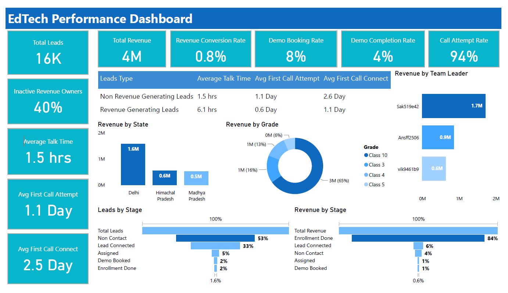

# **EdTech Sales Funnel Analytics**

<h3 align="center"> </h3>

  

## 🚨 **Problem :**

Despite a high volume of incoming leads, **40% of Lead Owners are not generating any revenue**, indicating a serious performance gap. A major issue lies in **delayed response times** — Non-Revenue Generating (Non-RG) Lead Owners take over **24 hours** to attempt contact, compared to just **3 hours** for Revenue Generating (RG) ones. Additionally, only **50% of booked demos are completed**, highlighting a key funnel leak. The **Main Stage sees a 53% drop-off** due to non-contact, especially for Non-RG owners. **Specific Team Leaders show consistent underperformance**. This inefficiency results in lost conversion opportunities and poor ROI on lead generation efforts.

## 🎯 **Objective :**

To identify what drives **revenue success among Lead Owners** by analyzing contact behavior, funnel progression, and conversion efficiency.
The goal is to highlight performance gaps, reduce drop-offs, and recommend targeted improvements to
**boost revenue generation** and **optimize sales engagement** across the funnel.

## 🛠️ **Approach :**

1. Segmented Revenue Generating vs. Non-Revenue Generating Agent cohorts
2. Analyzed funnel drop-offs and Turnaround Time (TAT)
3. Assessed agent-level performance
4. Reviewed call engagement, talk time, and demo outcomes
5. Geo and segment performance review

## ✅ **Outcome :**

1. **Revenue Generating agents:** 2x faster contact, 88% demo conversion, ₹4.5M revenue from 0.8% leads
2. **Non-Revenue Generating:** 53% drop-off due to non-contact, long TATs, poor follow-up
3. **Delhi + Class 10** show best conversions
4. Key TLs identified for performance review
